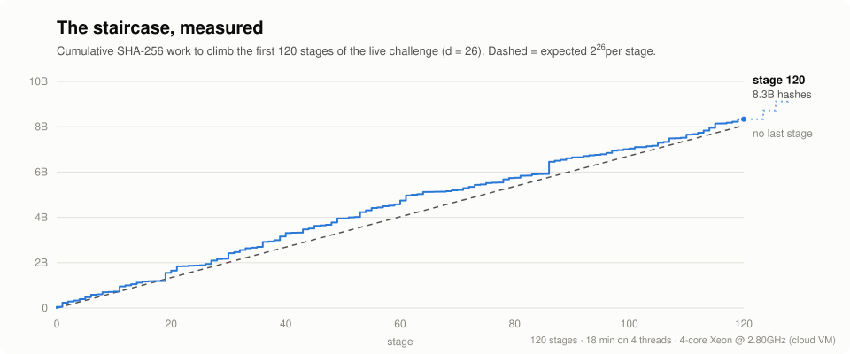
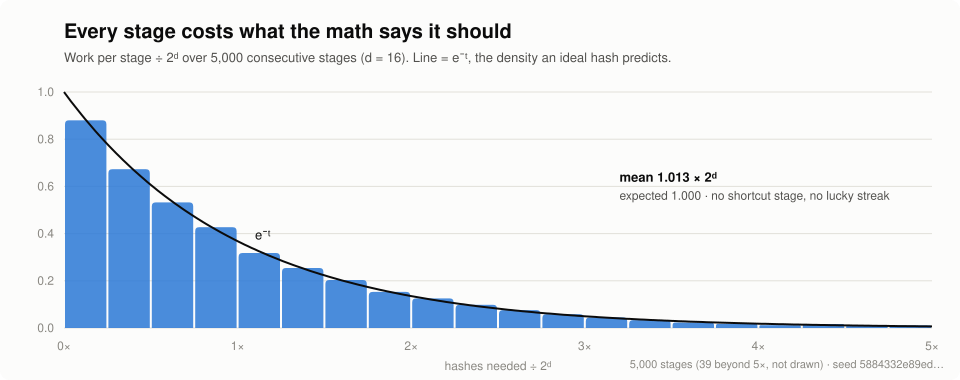
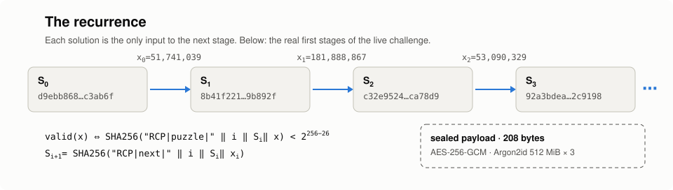
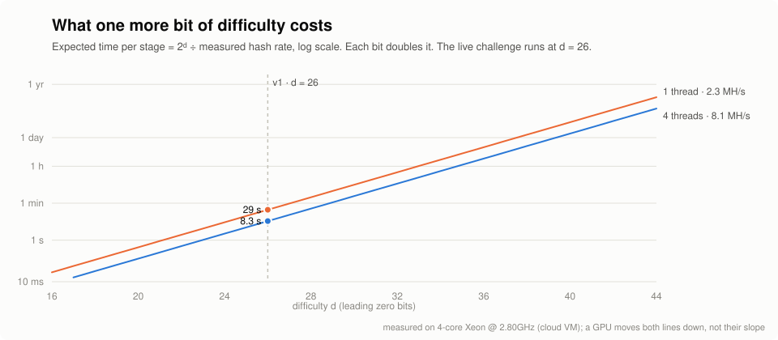

<div align="center">

# intratexxxt

*An unbounded recursive cipher. Every stage is a real cryptographic problem, and every solution is the only way to generate the next one.*

[](#getting-started)
[](FORMAT.md#the-staircase)
[-8a8a8a)](https://www.rfc-editor.org/rfc/rfc9106)
[](FORMAT.md#the-payload)
[](#status)
[-2ea44f)](#status)

**[🧩 The challenge](challenge.json)** · **[📐 Format](FORMAT.md)** · **[🔬 How it works](#how-it-works)** · **[🏁 Getting started](#getting-started)**

<picture>
  <!-- Regenerated from data/ by `python tools/plot.py` (CI fails if it drifts) -->
  <source media="(prefers-color-scheme: dark)" srcset="media/staircase-dark.svg" />
  <source media="(prefers-color-scheme: light)" srcset="media/staircase.svg" />
  
</picture>

</div>

---

intratexxxt is a small, stubborn experiment in a different kind of cipher. Almost every puzzle cipher you've seen is an onion: a fixed number of layers, made in advance, sitting on disk, and the last layer is the answer. That shape gives a lot away. There is a bottom, so you can measure how far you are from it, and someone made every layer, so every layer is stored somewhere. intratexxxt doesn't have that shape. It's a **recursive cipher**: a rule, not a stack. You start from a random 256-bit state, solve a SHA-256 work puzzle that is defined by that state, and your solution is the *only* thing that can produce the next state, which defines the next puzzle. Nothing is pre-generated. There's no list of stages anywhere, not even on my machine, and there is no last stage. I didn't build a big staircase. I wrote down how to build the next step, forever. Next to the staircase sits a sealed payload, 208 bytes of AES-256-GCM under an Argon2id-derived key, with a public commitment to what's inside. Nobody has opened it. The question intratexxxt asks is simple: can you?

For questions about the repo, open a thread in the [Discussions tab](https://github.com/ninjahawk/intratexxxt/discussions) or an [issue](https://github.com/ninjahawk/intratexxxt/issues).

## Status

**The lock is sealed.** Stage 0 was published on 2026-10-03. Everything a solver gets is in
[challenge.json](challenge.json): the initial state, the difficulty, the sealed payload and the
commitment. Every number below comes from the measured runs in [data/](data), drawn by
[tools/plot.py](tools/plot.py).

**Progress (2026-10-03):** 120 stages of the canonical chain solved and published in
[data/ledger.json](data/ledger.json), re-verified on every push by two independent implementations.
Payload: sealed.

- **The staircase.** Difficulty d = 26, so a stage takes 2^26 ≈ 67 million SHA-256 evaluations on average.
  That's about 29 seconds on one thread and 8 seconds on 4 threads of the reference machine
  (8.1 MH/s). Climbing the first 120 stages took 18 minutes and 8.3 billion hashes.
- **It behaves.** Over 5,000 consecutive stages at a lower difficulty, the work per stage averaged
  1.013 × 2ᵈ against an expected 1.000, and the distribution is the textbook geometric curve.
  No stage is cheap and none is impossible.
- **The lock.** Argon2id at 512 MiB × 3 passes × 4 lanes, about 1.2 s per attempt on the
  reference machine. It's memory-hard on purpose. Every attempt at the payload costs real memory
  and real time, on a GPU too.
- **The commitment.** `H("RCP|commit|" ‖ token)` = `14c5230d7e34eed984a34f002e05838c23664b8b935e986ab0a4107883645150`. The token is 256 random bits inside
  the plaintext and nowhere else. Whoever opens the payload can prove it by posting the plaintext.
  Nobody has to trust me, or the binary.

<picture>
  <source media="(prefers-color-scheme: dark)" srcset="media/work-dark.svg" />
  <source media="(prefers-color-scheme: light)" srcset="media/work.svg" />
  
</picture>

## The record

The main thing this repo maintains is a running table of how far up the staircase anyone has
gotten, and whether the payload has been opened. Send a transcript (`progress.json`) in a PR or an
issue and it gets a row once `verify.py` accepts it.

| # | highest stage | who | date | transcript | verified | payload |
|---|---------------|-----|------|------------|----------|---------|
| 0 | 120 (canonical) | ninjahawk | 2026-10-03 | [ledger.json](data/ledger.json) | ✅ `verify.py` + engine | sealed |

The record that matters is the last column. An opening counts when someone posts the **full
plaintext**, with its `RCP-SUCCESS-v1` header and verification token, and the token hashes to the
commitment above. A patched binary that prints "success" doesn't count. That's exactly why the
commitment exists.

## Getting started

### Setup

Grab the binary for your platform from [bin/](bin) and check it against the published sums.
Linux, macOS (Intel and Apple Silicon) and Windows are all supported, and there's nothing to
install.

```bash
git clone https://github.com/ninjahawk/intratexxxt
cd intratexxxt
(cd bin && sha256sum -c SHA256SUMS)       # macOS: shasum -a 256 -c SHA256SUMS
cp bin/intratexxxt-linux-amd64 ./intratexxxt && chmod +x intratexxxt
# macOS: the binaries aren't notarized, so clear the quarantine flag once
# xattr -d com.apple.quarantine intratexxxt
```

The binary looks for `challenge.json` in the current directory, then next to itself. Your progress
goes to `progress.json` (or `-p path`). Every load re-verifies the whole transcript from stage 0.

### Climb

```bash
./intratexxxt status            # stage, state, difficulty
./intratexxxt bench             # your hash rate and expected seconds per stage
./intratexxxt mine -n 10        # solve the next 10 stages (canonical: smallest valid nonce)
./intratexxxt mine -n 0         # keep going until Ctrl-C; the transcript saves after every stage
```

Or bring your own solver. It's one SHA-256 and a comparison, fully specified in
[FORMAT.md](FORMAT.md). Submit nonces one at a time and the engine checks each one:

```bash
./intratexxxt submit 48120773   # rejected unless it meets the target for the current stage
```

Then check the work, ideally with something that isn't the binary:

```bash
./intratexxxt verify                     # the engine's check
python verify.py transcript progress.json # an independent standard-library reimplementation
python verify.py stage 0 <S_0> <x_0>      # one stage by hand: prints S_1
```

### The payload

```bash
./intratexxxt open "<string>"   # one Argon2id + one AES-256-GCM authentication, about 1.2 s
```

It prints `sealed.` and exits with code 3, or it prints the plaintext and checks the token against
the commitment. Nothing else about the binary changes either way: the staircase behaves identically
no matter what you've tried to open it with.

A few more notes:

- Your transcript is yours to keep. It's plain JSON and it re-verifies anywhere.
- The miner always returns the *smallest* valid nonce, so honest solvers produce byte-identical
  chains. If yours differs from [data/ledger.json](data/ledger.json) on a shared stage, one of you
  skipped a nonce.
- `mine -t N` caps the threads, if you want your computer back.
- A transcript from another challenge file is refused: stage 0 and d have to match.

## How it works

The whole design is about making every step real while making sure no step exists before it's
earned.

1. **The recurrence.** At stage `i` the public state is `S_i`. A solution is any 64-bit `x` with
   `SHA256("RCP|puzzle|" ‖ i ‖ S_i ‖ x) < 2^(256−d)`. The next state is
   `S_(i+1) = SHA256("RCP|next|" ‖ i ‖ S_i ‖ x)`. That's the entire rule.
2. **Sequential dependency.** `S_(i+1)` takes `x_i` as input, so you can't know stage i+1, let alone
   stage i+1000, until stage i is actually solved. There's nothing to precompute and nothing to
   parallelize *across* stages. You can only parallelize the search inside one.
3. **Unbounded by induction.** There's no `if i == 1000: stop`. If stage i is solved, the formula
   defines stage i+1, so there is a well-defined next stage after every finite number of solved
   ones. The binary stores the rule, not the stages.
4. **Cheap to check, expensive to find.** Verifying a stage is one hash and one comparison. Finding
   one takes 2ᵈ hashes on average, and every extra bit of d doubles that. The cost follows a
   geometric distribution with no memory, so being close to a solution is meaningless. Each
   attempt is a fresh coin flip.
5. **Domain separation and canonical encoding.** The puzzle test and the state transition use
   different labels, so they're different functions of the same input. Integers are fixed-width
   big-endian, so there is exactly one byte string for every stage. Two implementations can't
   disagree about which puzzle is being solved.
6. **A canonical chain.** Every honest solver takes the smallest valid nonce, so the chain is a
   pure function of `S_0` and d. That makes the [ledger](data/ledger.json) reproducible by anyone
   with a CPU and some patience.
7. **The sealed payload.** The plaintext is encrypted with AES-256-GCM under a 256-bit key from
   Argon2id. GCM is authenticated, so there's no "almost right" key. A candidate either opens it
   or fails, and nothing leaks in between. Argon2id is memory-hard, so every attempt costs half a
   gigabyte for over a second, which is what keeps it expensive on GPUs too.
8. **A public commitment.** Before release, `SHA256("RCP|commit|" ‖ token)` was published, with the
   token sealed inside the plaintext. Opening the payload is provable, and the token can't have
   been invented after the fact.

<picture>
  <source media="(prefers-color-scheme: dark)" srcset="media/chain-dark.svg" />
  <source media="(prefers-color-scheme: light)" srcset="media/chain.svg" />
  
</picture>

The difficulty was tuned on purpose. At d = 26 a stage takes seconds on a laptop, so anyone
can climb. Each extra bit doubles the time, so the dial goes from trivial to geological in about
twenty bits:

<picture>
  <source media="(prefers-color-scheme: dark)" srcset="media/difficulty-dark.svg" />
  <source media="(prefers-color-scheme: light)" srcset="media/difficulty.svg" />
  
</picture>

The important thing to note is that every stage is real. None of it is a progress bar painted
over a timer. Each stage is a genuine SHA-256 preimage-style search with a genuine answer, and
you can check every one of them with `verify.py` without trusting the binary at all. What the
staircase is *for* is the part intratexxxt leaves to you. "Unbounded cryptographic staircase" is
the most honest description I have: there's no top, so nobody can tell you how close you are.

## Guides

- [FORMAT.md](FORMAT.md) has the exact byte layout of every hash, `challenge.json`, the payload,
  and transcripts. It's enough to write your own solver.
- [verify.py](verify.py) is the reference reimplementation of the staircase, standard library only,
  plus a slow pure-Python solver you can read.
- [data/](data) holds the measured runs behind every chart. `trace.json` is the live challenge,
  `sweep.json` is the low-difficulty distribution run, and `ledger.json` is the canonical chain.
- [tools/plot.py](tools/plot.py) redraws every chart from `data/`. CI fails if the committed charts
  drift from the data.

## File structure

```
.
├── challenge.json                  # Stage 0, difficulty, the sealed payload, the commitment
├── FORMAT.md                       # Byte-exact spec: staircase, payload, transcripts
├── verify.py                       # Independent staircase verifier + reference solver (stdlib only)
├── bin
│   ├── intratexxxt-linux-amd64     # The engine: status, mine, submit, verify, open, bench
│   ├── intratexxxt-linux-arm64
│   ├── intratexxxt-darwin-amd64
│   ├── intratexxxt-darwin-arm64
│   ├── intratexxxt-windows-amd64.exe
│   └── SHA256SUMS
├── data
│   ├── ledger.json                 # The canonical chain so far (a progress.json transcript)
│   ├── trace.json                  # Measured run on the live challenge: work + time per stage, hash rates
│   └── sweep.json                  # Low-difficulty run for the work-per-stage distribution
├── tools
│   └── plot.py                     # Renders the charts from data/
├── media/                          # The charts (light + dark SVG)
└── .github/workflows               # CI: checksums, ledger re-verification, chart drift
```

## Contributing

The goal of intratexxxt is narrow on purpose: one staircase, one payload, one clean public record
that holds up when someone hostile reads it. It's not a cryptocurrency, there's no token, and
nothing is for sale. The engine ships as binaries for v1. The staircase is fully specified in
[FORMAT.md](FORMAT.md) and reimplemented in [verify.py](verify.py), so you never have to trust the
binary to check a stage.

Transcripts are very welcome, at any height. So are independent solvers (GPU, Rust, FPGA,
whatever you've got), second verifiers, and better analysis of the staircase. If you think you've
found structure in it, open an issue with the transcript and the claim. Please don't open PRs
that edit `challenge.json` or the ledger by hand. CI will refuse them anyway.

Current AI policy: disclosure. When submitting a PR, please declare any parts that had substantial
LLM contribution. Worth saying out loud: a lot of this repo was written with the help of Claude.
That's exactly why every stage verifies with a script you can read, every chart is redrawn from
raw data in CI, and the payload is bound to a public commitment. You shouldn't have to trust the
author, human or otherwise.

## Acknowledgements

- Argon2 is [RFC 9106](https://www.rfc-editor.org/rfc/rfc9106) (Biryukov, Dinu, Khovratovich), and
  AES-GCM is [NIST SP 800-38D](https://csrc.nist.gov/pubs/sp/800/38/d/final). intratexxxt uses them as
  published and doesn't roll its own crypto.
- The staircase stands on chained hash puzzles going back to [Hashcash](http://www.hashcash.org/papers/hashcash.pdf)
  (Adam Back) and on [time-lock puzzles](https://people.csail.mit.edu/rivest/pubs/RSW96.pdf)
  (Rivest, Shamir, Wagner, 1996).
- The README format is borrowed from [nanochat](https://github.com/karpathy/nanochat), which is a
  model of how to write one.
- Thanks to everyone who ever stared at a cipher and thought "it's just more compute". This repo is
  for you.
- intratexxxt is an independent project.

## Cite

If you find intratexxxt helpful in your research cite simply as:

```bibtex
@misc{intratexxxt,
  author = {ninjahawk},
  title = {intratexxxt: an unbounded recursive cipher},
  year = {2026},
  publisher = {GitHub},
  url = {https://github.com/ninjahawk/intratexxxt}
}
```

## License

MIT
